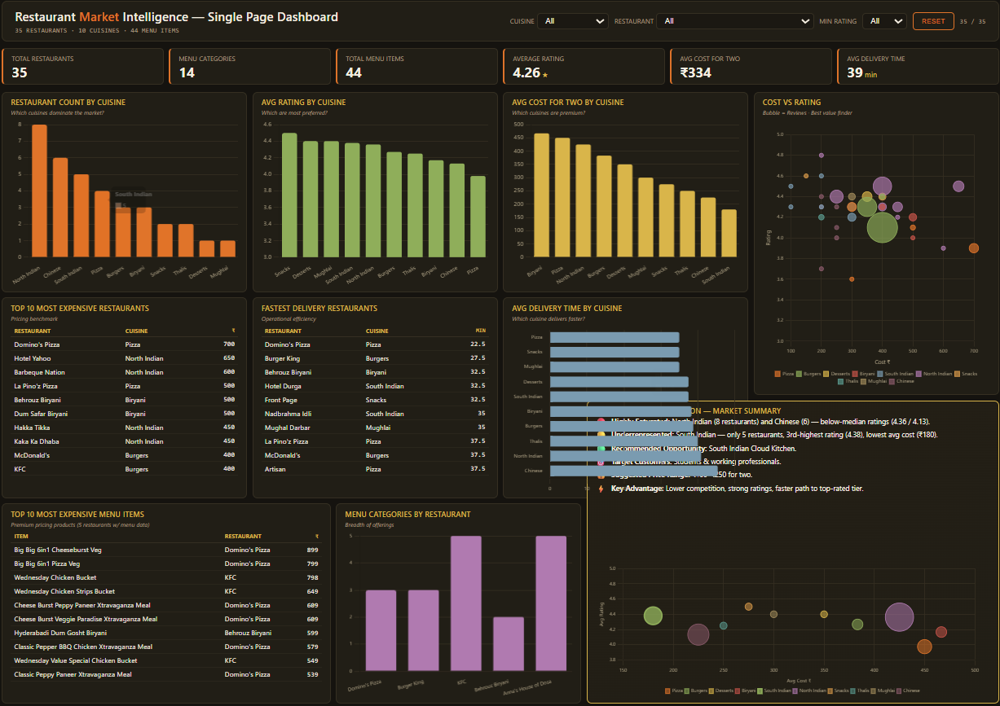

# 🍽️ Cloud Kitchen Market Intelligence & Business Analytics

## 📌 Project Overview

This project presents an end-to-end market intelligence analysis for launching a cloud kitchen using real-world restaurant data collected from the Swiggy platform. The objective was to analyze the competitive landscape, pricing strategies, customer preferences, and operational trends to identify the most promising cuisine opportunity for a new cloud kitchen.

The project combines data collection, API investigation, SQL analysis, Python-based data exploration, and dashboarding to generate actionable business insights.

---

## 🎯 Business Objective

A cloud kitchen startup plans to enter the **College Road, Nashik** market with a limited investment.

This project aims to answer key business questions such as:

- Which cuisines dominate the market?
- Which cuisines are underrepresented?
- What is the average pricing in the locality?
- Which restaurants perform the best?
- Which cuisine presents the best business opportunity?
- What pricing strategy should a new cloud kitchen adopt?

---

## 🛠️ Tech Stack

- **SQL (MySQL)** – Database design and business analysis
- **Python** – Data cleaning and exploratory data analysis
- **Pandas** – Data manipulation
- **Jupyter Notebook** – Data analysis workflow
- **Power BI** – Interactive dashboard creation
- **Browser Developer Tools** – Network/API investigation
- **Git & GitHub** – Version control and project hosting

---

## 📊 Dataset

The project consists of three structured datasets.

### Restaurants Dataset
Contains restaurant-level information including:
- Restaurant Name
- Cuisine
- Rating
- Reviews
- Cost for Two
- Delivery Time
- Locality

### Menu Categories Dataset
Contains menu category information for each restaurant.

### Menu Items Dataset
Contains:
- Restaurant Name
- Menu Category
- Item Name
- Item Price

---

## 🔍 Project Workflow

```text
Restaurant Selection
        ↓
Network/API Investigation
        ↓
Data Collection
        ↓
CSV Dataset Creation
        ↓
MySQL Database Design
        ↓
SQL Analysis
        ↓
Python Data Cleaning
        ↓
Power BI Dashboard
        ↓
Business Insights & Recommendations
```

---

## 📈 Dashboard Highlights

The Power BI dashboard provides:

- Market Overview
- Cuisine Distribution
- Average Rating by Cuisine
- Pricing Analysis
- Restaurant Performance Analysis
- Delivery Time Analysis
- Menu Intelligence
- Executive Business Recommendations

---

## 📌 Key Business Insights

- North Indian and Chinese cuisines dominate the selected locality.
- South Indian cuisine is comparatively underrepresented while maintaining strong customer ratings.
- Premium restaurants generally have higher average ratings and larger review counts.
- Delivery times remain competitive across most restaurants.
- The recommended opportunity is to launch a **South Indian Cloud Kitchen** targeting students and working professionals with affordable pricing.

---

## 💼 Business Recommendation

### Recommended Cuisine
✅ South Indian

### Target Customers
- Students
- Young Professionals
- Families

### Suggested Pricing
₹100 – ₹250

### Competitive Advantage
- Lower competition
- Strong customer demand
- Affordable pricing
- High customer ratings

---

## 📂 Repository Structure

```
Cloud-Kitchen-Market-Intelligence/
│
├── Data/
│   ├── restaurants.csv
│   ├── menu_categories.csv
│   └── menu_items.csv
│
├── SQL/
│   └── Cloud_Kitchen_SQL_Analysis.sql
│
├── Notebook/
│   └── Cloud_Kitchen_Analysis.ipynb
│
├── Dashboard/
│   ├── Cloud_Kitchen_Dashboard.pbix
│   ├── Dashboard_Overview.png
│   └── Interactive_Dashboard.html
│
└── README.md
```

---

## 📸 Dashboard Preview


---

## 🚀 Future Enhancements

- Automate restaurant data collection using APIs or web scraping (where permitted).
- Develop a real-time dashboard with scheduled refresh.
- Build an AI-powered restaurant recommendation assistant.
- Expand the analysis to multiple cities for comparative market intelligence.
- Add forecasting for demand and pricing trends.

---

## 👨‍💻 Author

**Devendra Kumar**

B.Tech, Indian Institute of Technology Guwahati

**Interested Roles**

- Data Analyst
- Business Analyst
- Product Analyst

LinkedIn: *(https://www.linkedin.com/in/devendra-kumar-918775256/)*

GitHub: *(https://github.com/devendrakumar2901)*

---

